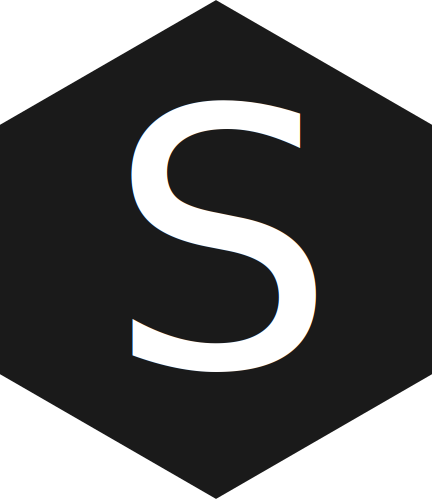

#  Sure-JS [](https://travis-ci.org/ElectricCookie/sure-js) 

Sure-JS is a Schema language that allows you to create Schemas which you can use in JavaScript, TypeScript and Java. Its Syntax allows for type checking, validation and automatic population. 


## Example
```

#Person
object(){
	id: str(length=36)

	title: str(minLength=3,maxLength=4)

	description: str(minLength=4,maxLength=10)

	hobbies: arr(){
		@Hobby
	}
}


#Hobby
object(){
	id: str(length=36)

	title: str(minLength=3,maxLength=4)

	description: str(minLength=4,maxLength=10)
}

```	

## Default types


| Identifiers   | Childmode   | Type-Id   |
|---------------|-------------|-----------|
| obj,object    | named       | object    |
| str,string    | none        | string    |
| nr,number     | none        | number    |
| bool,boolean  | none        | boolean   |
| arr,array     | single      | array     |
```